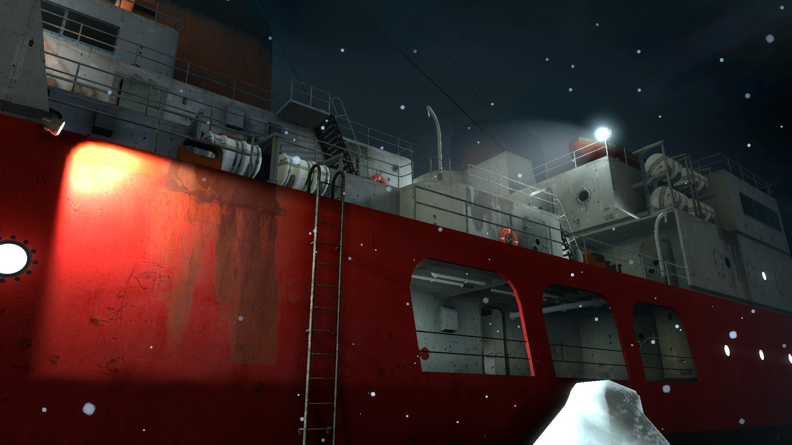

    

## Sobre o projeto:

Este projeto tem como objetivo recriar os mapas, sons e modelos apresentados na E3 de 2002, trazendo essa experiência única para a versão comercial do Half-Life 2. Embora ainda estejamos em fase de desenvolvimento, já disponibilizamos os mapas E3_Ship e E3_Town, agora totalmente jogáveis, com modelos de armas e texturas extraídos diretamente da versão beta do jogo. Estamos comprometidos em continuar atualizando o projeto e planejamos incluir ainda mais mapas no futuro, sempre mantendo fidelidade ao material original apresentado naquela icônica demonstração da E3.

  
  
  

## Instalação:

1. Vá para a Workshop e se inscreva no addon.  
2. Pronto! Agora é só jogar.

### Manualmente
1. Baixe o arquivo .7z e extraia seu conteúdo.
2. Pegue a pasta `custom` e coloque dentro da pasta `hl2`, normalmente localizada em:
- `C:\Program Files (x86)\Steam\steamapps\common\Half-Life 2\hl2`
3. Abra o jogo e digite no console: `map e3_depot`
4. Pronto! Agora é só jogar.

[Baixar no Github](https://github.com/source-br/Pool-Day-Rebuild/releases)

[Baixar na Oficina Steam](https://steamcommunity.com/sharedfiles/filedetails/?id=3369325747)

## Créditos:

Mapa criado por [KaPA](https://steamcommunity.com/profiles/76561198413389198)

## Créditos de itens usados
Modelo da pistola: Quaker-Craft

Hydra Combine 2002: Eye of the Aist

Som da pistola: JJ.mdl

Modelo de zumbi: Jman
## Registro de alterações
1.3 (quarrytown & borealis)

    Melhorias em E3_borealis e compilação com Slammin Tools
    Melhorias em E3_quarrytown e compilação com Slammin Tools
    Novo áudio adicionado para batidas em madeira (knock on wood)
    Curso de treinamento de 2001 removido
    Melhorias visuais
    Adicionado modelo de zumbi gordo (Fat zombie)

[Ver registro completo](../PT-BR/Registro%20de%20alterações.md)

