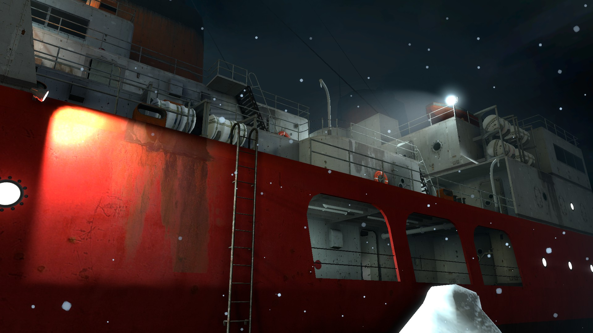
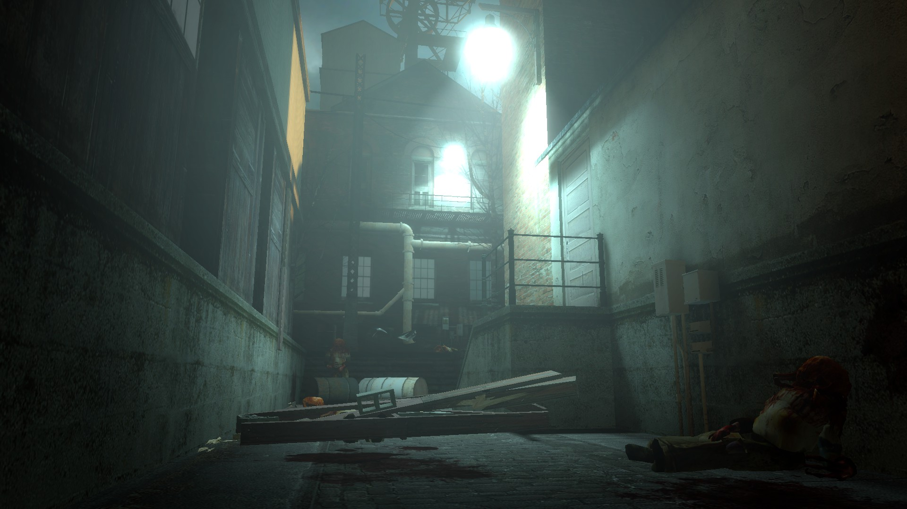
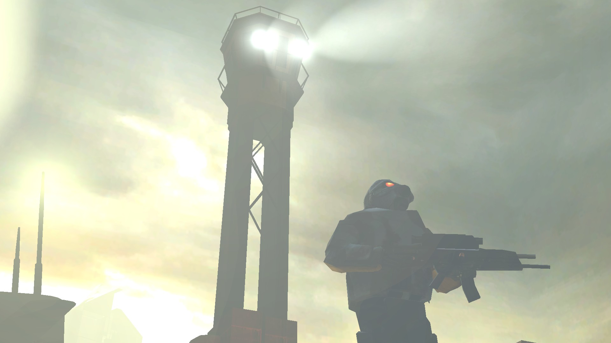

    

## About the project:

This project aims to recreate the maps, sounds, and models showcased at E3 2002, bringing that unique experience to the retail version of Half-Life 2.
Although we are still in the development phase, we have already released the E3_Ship and E3_Town maps, now fully playable, featuring weapon models and textures extracted directly from the game's beta version.
We are committed to continuing updates to the project and plan to include even more maps in the future, staying faithful to the original material presented in that iconic E3 demonstration.

  
  
  

## Installation:

1. Go to the Workshop and subscribe to the addon.
2. Done! You're now ready to play.

### Manually
1. Download the .7z file and extract its contents
2. Grab the `custom` folder and drop it into your `hl2` folder, usually located at:
- `C:\Program Files (x86)\Steam\steamapps\common\Half-Life 2\hl2`
3. Launch the game and run in the console: `map e3_depot`
4. Done! You're ready to play.

[Download no Github](https://github.com/source-br/Pool-Day-Rebuild/releases)

[Download on Steam Workshop](https://steamcommunity.com/sharedfiles/filedetails/?id=3369325747)

## Credits:

Map created by [KaPA](https://steamcommunity.com/profiles/76561198413389198)

## Credits for items used:
Pistol model: Quaker-Craft

Hydra Combine 2002: Eye of the Aist

Pistol sound: JJ.mdl

Zombie model: Jman
## Changelog
1.3 (quarrytown & borealis)

    Improvements to E3_borealis and compiled with Slammin Tools
    Improvements to E3_quarrytown and compiled with Slammin Tools
    added new audio to knock on wood
    2001 hazard course removed
    Visual improvements
    Added Fat zombie model

[See full changelog](Docs/Changelog.md)

